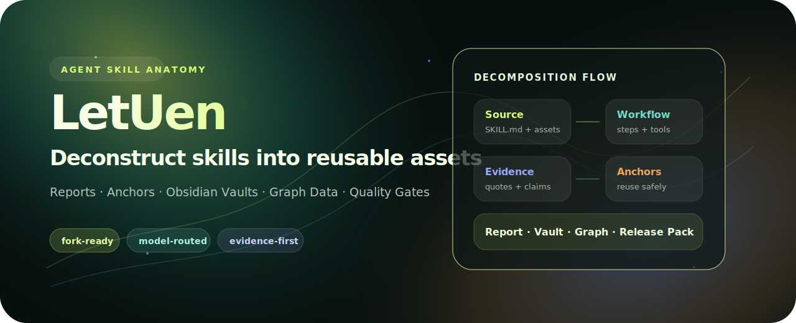

<p align="center">
  
</p>

# LetUen / Agent Skill Anatomy

<p align="center">
  <a href="README.zh-CN.md">中文</a> · <strong>English</strong>
</p>

<p align="center">
  <a href="https://github.com/3yesore/LetUenforskills/actions/workflows/ci.yml"></a>
  <a href="https://github.com/3yesore/LetUenforskills/releases"></a>
  <a href="LICENSE"></a>
  
</p>

LetUen is a multi-agent research harness for deconstructing Agent Skills and agent workflows into readable manuals, reusable anchors, Obsidian knowledge vaults, graph data, and release-ready skill packs.

It is designed for people who want to understand how a skill works, extract the reusable parts, compare model outputs, and recombine selected capabilities without damaging existing user skill structures.

## Why LetUen

Most skill repositories show the final `SKILL.md`, scripts, and assets, but not the design logic behind them. LetUen turns a skill repository into a structured anatomy:

- **What it is** — identity, trigger intent, boundaries, expected user request shape.
- **How it works** — workflow stages, tool usage, scripts, references, assets, and runtime assumptions.
- **Why it is trustworthy** — evidence-grounded claims, deterministic quality gates, reviewer summaries, and evidence repair.
- **How to reuse it** — anchors, composition plans, Obsidian notes, reusable templates, and non-destructive integration guidance.

## Outputs

| Surface | What it gives you | Status |
| --- | --- | --- |
| **Report** | A readable skill anatomy manual for humans. | Working |
| **Cinema / Repo UI** | Local static presentation surfaces for decomposition results. | Working demo surface |
| **Obsidian Vault** | Bilingual notes, MOCs, Mermaid maps, evidence notes, and reusable assets. | Working |
| **Data / Graph** | JSONL, CSV, Mermaid, and graph-ready artifacts. | Working |
| **Anchor Pack** | `skills/asa-*` method skills and anchor composition contracts. | Developer preview |
| **Quality Gates** | Deterministic checks, reviewer summaries, source-aware evidence repair. | Working |

## Repository Scope

This repository currently contains the full LetUen project:

- Python harness and providers
- Static UI surfaces
- report / vault / data / graph exporters
- internal method skills
- tests and sample outputs
- packaged developer-preview skill anchor pack

A smaller skill-only repository can be published later from the `package-letuen-skill` artifact. The current repo intentionally keeps the full system together so the harness, UI, docs, and skill pack can evolve in sync.

## Quick Start

Run the mock pipeline first. It does not require model API keys.

```powershell
cp .env.example .env
$env:PYTHONPATH='src'
python -m asa run --config anatomy.config.example.yaml
python -m asa export-letuen --run runs\<run-id> --output dist\letuen-demo
```

Start the local visual surface:

```powershell
npm install
npm run demo:export
npm run demo:serve
```

Open `http://localhost:4173/`.

## Real Model Runs

The default config uses `mock`. For real multi-agent calls, copy one provider config and set the matching key in `.env` or your shell.

| Provider route | Config file | API key env | Base URL |
| --- | --- | --- | --- |
| OpenAI · gpt-5.2 | `anatomy.openai.example.yaml` | `OPENAI_API_KEY` | `https://api.openai.com/v1` |
| Claude · Opus 4.5 | `anatomy.claude.example.yaml` | `ANTHROPIC_API_KEY` | `https://api.anthropic.com/v1` |
| DeepSeek · V4 Pro | `anatomy.deepseek.example.yaml` | `DEEPSEEK_API_KEY` | `https://api.deepseek.com/v1` |
| Qwen · Qwen3.7 Max | `anatomy.qwen.example.yaml` | `DASHSCOPE_API_KEY` | `https://dashscope.aliyuncs.com/compatible-mode/v1` |
| Moonshot · moonshot-v1-32k | `anatomy.moonshot.example.yaml` | `MOONSHOT_API_KEY` | `https://api.moonshot.cn/v1` |

Recommended first real run:

```powershell
cp anatomy.openai.example.yaml anatomy.config.yaml
cp sources.github.example.yaml sources.yaml
notepad .env
$env:PYTHONPATH='src'
python -m asa plan-run --config anatomy.config.yaml --limit-skills 1
python -m asa run --config anatomy.config.yaml --limit-skills 1
python -m asa quality-run --run runs\<run-id> --output runs\<run-id>\quality_report.json
python -m asa export-letuen --run runs\<run-id> --output dist\letuen-real
```

Use `--limit-skills 1` until the provider route, cost, schema validation, and artifact quality look stable.

## Harness Flow

```text
GitHub URL / Local Path
  -> Collector
  -> Structure Analyst
  -> Workflow Analyst
  -> Pattern Miner
  -> Asset Builder
  -> Reviewer
  -> Quality Gates
  -> Report / Vault / Data / Anchors
```

## Local Model Bridge

The static UI can call a local-only bridge for connection tests and homepage GitHub URL analysis.

```powershell
$env:PYTHONPATH='src'
python scripts/local_bridge.py
```

Then open `http://localhost:4173/settings/models/`. The bridge does not persist keys. For CLI runs, store keys in `.env` using the mapped environment variable.

## Skill Anchor Pack

The developer-preview method pack is available in the GitHub Release and under `releases/`:

- `releases/letuen-skill-anchor-pack-v0.2.0-dev.zip`
- `releases/letuen-skill-anchor-pack-v0.2.0-dev.tar.gz`
- `releases/SHA256SUMS.txt`

Rebuild it locally:

```powershell
$env:PYTHONPATH='src'
python -m asa package-letuen-skill --output releases --version v0.2.0-dev
```

The pack contains a coordinator `SKILL.md`, 9 `skills/asa-*` method skills, anchor schemas, non-destructive invocation policy, and sample anchor composition assets.

## CLI Cheat Sheet

```powershell
$env:PYTHONPATH='src'
python -m asa collect --source examples/sample-skill --output runs/manual-collect/inventory.json
python -m asa run --config anatomy.config.example.yaml
python -m asa validate --run runs/<run-id>
python -m asa review-run --run runs/<run-id> --output runs/<run-id>/review_summary.json
python -m asa repair-evidence --run runs/<run-id>
python -m asa quality-run --run runs/<run-id> --output runs/<run-id>/quality_report.json
python -m asa export-report --run runs/<run-id> --output site/report
python -m asa export-vault --run runs/<run-id> --output vault
python -m asa export-data --run runs/<run-id> --output site/data
python -m asa export-anchors --run runs/<run-id> --output dist/anchors.json
python -m asa export-letuen --run runs/<run-id> --output dist/<run-id>
python -m asa smoke-github --sources sources.smoke.github.yaml --output runs/github-smoke
python -m asa package-letuen-skill --output releases --version v0.2.0-dev
```

## Repository Layout

```text
src/                  Python harness, providers, exporters, quality gates
site/                 Static UI: home, cinema, repo, data/settings surfaces
skills/               LetUen internal method skills and anchor-aware workflow skills
docs/                 Design specs, harness contracts, UI/output strategy
examples/             Sample skill, sample vault, anchor composition examples
runs/demo-multi-skill Committed demo run used by export/demo scripts
releases/             Developer-preview skill anchor pack archives
tests/                Unit tests for runtime, exporters, quality, packaging
```

## Documentation Map

- `docs/fork-ready-guide.md` — clone/fork usage, CI, sample vault workflow.
- `docs/harness-spec.md` — runtime state machine and quality gates.
- `docs/agent-protocol.md` — agent responsibilities and boundaries.
- `docs/evidence-spec.md` — evidence object contract and confidence rules.
- `docs/provider-spec.md` — model provider interface, retry, and OpenAI-compatible adapter.
- `docs/letuen-usage-guide.md` — end-to-end commands for report, vault, data, anchors, and composition plans.
- `docs/letuen-skill-anchor-pack-design.md` — anchor-based skill decomposition and recomposition method pack.
- `docs/graph-data-surface-spec.md` — data table contracts, graph nodes/edges, manifest, and UI expectations.
- `docs/ui-strategy.md` — local research dashboard and public website direction.

## Release Status

Current developer preview: `v0.2.0-dev`.

- CI is active on `main`.
- The release asset is a method skill pack, not the full Python harness.
- The full repository remains the source of truth for harness + UI + skill pack development.

## License

MIT. See `LICENSE`.
