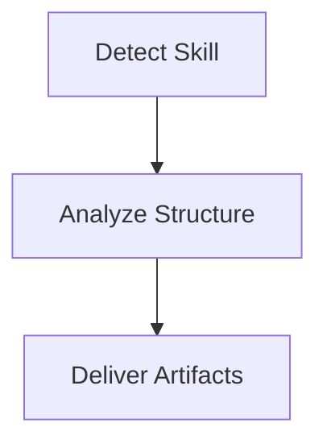

# sample-skill

## Summary 摘要

- ZH: sample-skill 的结构分析占位结果。
- EN: Placeholder structure analysis for sample-skill.

## Anatomy 结构解剖

- Skill file: `SKILL.md`
- Root path: `.`
- Scripts: 0
- References: 0
- Assets: 0

## Workflow 工作流拆解

- ZH: 占位工作流：识别技能、读取结构、产出分析。
- EN: Placeholder workflow: detect skill, inspect structure, produce analysis.

## Mermaid Flow 流程图

## Review 审查

- Status: `needs_revision`

## Evidence 原始证据

Mock mode does not include evidence. Real analyst agents must populate evidence fields.
